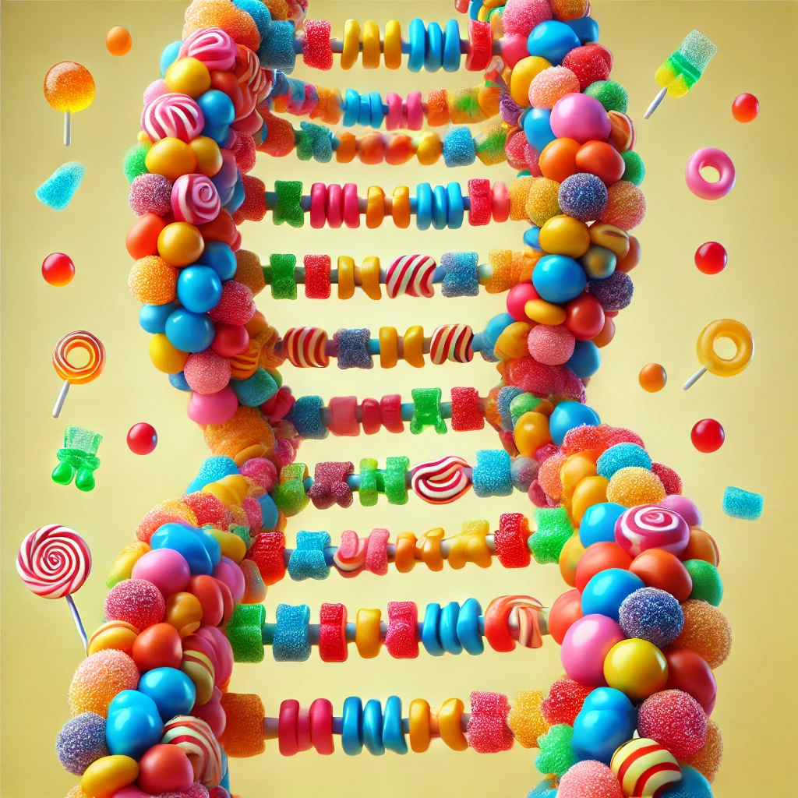

# CANDy
DNA compression method

# Method
Replace each DNA char with chars closer together in ascii space. Replacement chars starting at chr(0) seem to work better.

# Results
Zstd (level 22) compresses this DNA sequence sample 80%, and we improve this by 1%
